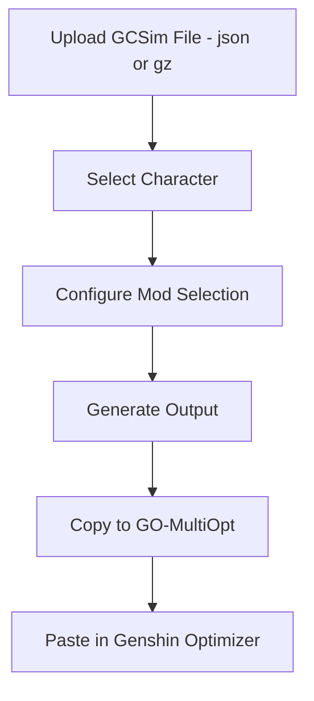
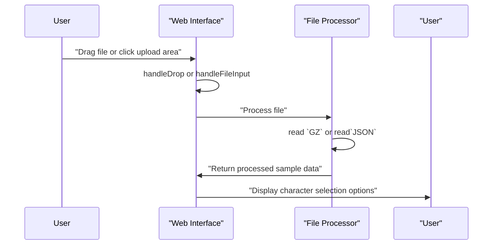
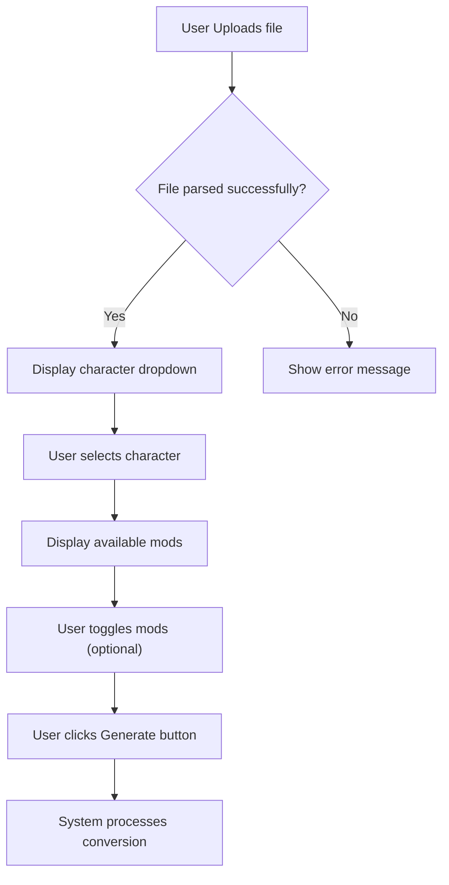
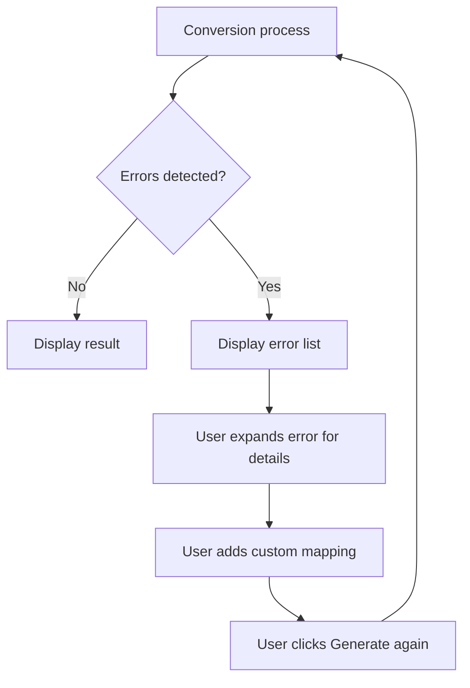
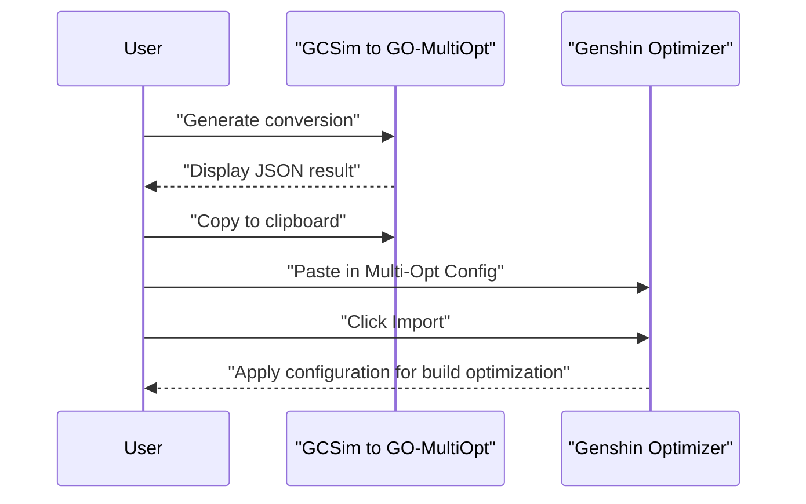

# GCSim to GO-MultiOpt

Easily transform your [gcsim](https://github.com/genshinsim/gcsim) sample files into optimized configurations for [Genshin Optimizer](https://frzyc.github.io/genshin-optimizer/#/tools/multi-opt) — no technical hassle!

## What is this tool?
This website allows you to convert gcsim simulation results into configuration files ready to use in Genshin Optimizer's Multi-Opt tool. This way, you can quickly, visually, and easily analyze and compare character builds.

## Features
- Instant and accurate conversion of gcsim samples.
- Intuitive and modern interface with animated visual effects.
- Highlighted descriptions and links for better understanding.
- Compatible with all modern browsers.
- No installation or technical knowledge required.

---

# User Guide

## How to use it?
1. **Run your simulation in gcsim** and download the sample file (`.json`) from the "Sample" tab.
2. **Drag your file** or click on the upload area to select it.
3. The tool will automatically convert the content and display the configuration, ready to copy.
4. **Import the result** into the Multi-Optimization Target Config section of Genshin Optimizer.

---

## Overview of the Conversion Process


## 1. Uploading GCSim Files

### Prerequisites
Before using the conversion tool, you'll need to:

1. Run a simulation in gcsim for your desired character/team
2. Download the sample file (either `.json` or `.gz` format) from the "Sample" tab in gcsim

### Upload Process
1. Visit the [GCSim to GO-MultiOpt](https://thebertdark.github.io/gcsim-to-multiopt/) website
2. Upload your file using one of these methods:
   - Drag and drop your sample file onto the upload area
   - Click on the upload area to browse and select your file



## 2. Selecting Characters and Mods
After uploading your file, the tool will automatically parse it and display available characters from the simulation.

### Character Selection
1. Choose a character from the dropdown menu
   - The dropdown will show all character names detected in your sample file
   - By default, the first character is selected
2. (Optional) Enter a configuration name
   - This will be displayed in Genshin Optimizer when you import the configuration
   - If left blank, it will default to "Powered by DarkJake"

### Mod Selection
The tool displays all available "mods" from your simulation data. Mods represent specific abilities, effects, or buffs that were active during the simulation.
1. By default, all mods are active (included in the conversion)
2. Click on mods you want to ignore/exclude from the conversion
   - Green boxes indicate active mods that will be included
   - Red boxes indicate inactive mods that will be ignored



## 3. Handling Conversion Errors
The tool may encounter errors during the conversion process. These are typically related to unknown abilities, stats, or elements that the converter doesn't recognize.

### Common Error Types

**1. Unknown ability errors**
- When the tool encounters an ability name that isn't in its mapping system
- Example: `Unknown ability "New Character Ability"`

**2. Unknown stat errors**
- When the tool doesn't recognize a stat type in the simulation data
- Example: `Unknown stat "custom_stat"`

**3. Unknown element errors**
- When the tool encounters an element type it doesn't recognize
- Example: `Unknown element "custom_element"`

### Error Resolution
For unknown abilities, you can manually add them to the conversion map:

1. When an error occurs, click on the error to expand it and see details
2. In the textarea below the errors, add a JSON object mapping the unknown ability to its appropriate type and subtype:

```json
{
    "Normal 0": ["normal", "0"],
    "Bake-Kurage": ["skill", "dmg"],
    "Sea-Dyed Foam": ["artifact:OceanHuedClam", "heal"]
}
```
After adding the mapping, click the "Generate" button again to retry the conversion.



## 4. Using the Results in Genshin Optimizer
Once the conversion is successful, the tool will display the generated `JSON` configuration.

### Copying the Results
1. Click the "Copy to Clipboard" button on the right side of the result box
2. A toast notification will confirm that the content has been copied

### Importing into Genshin Optimizer
1. Open [Genshin Optimizer](https://frzyc.github.io/genshin-optimizer/)
2. Navigate to the Optimize tool
3. Scroll down to the "Multi-Optimization Target Config" section
4. Click the "Import Multi-Opt" button
5. Paste the copied JSON into the configuration field
6. Click "Import" to import the configuration
7. Click "Select an Optimization Target" to select the imported configuration
8. Click "Generate Builds" to generate the builds based on the imported configuration




## Who made this?
Developed and maintained by [DarkJake](https://github.com/TheBertDark), inspired by the Genshin community and the original project by [imring](https://imring.github.io/gcsim-to-multiopt/).

---

Have questions, suggestions, or found a bug? Contact me on Discord: [DarkJake#6238](https://discord.com/users/723426524585525300) or open an issue in this repository!

Thanks for using GCSim to GO-MultiOpt!
